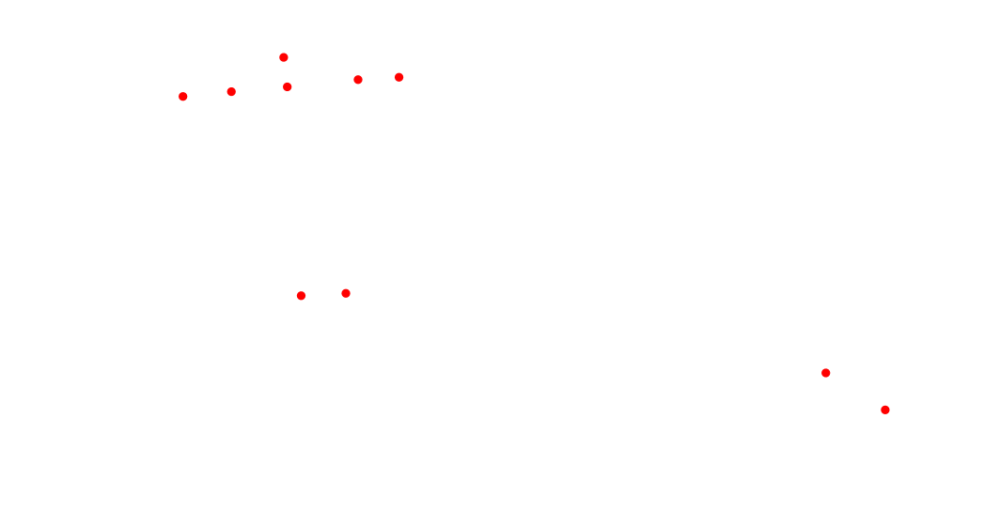

% MapServer web mapping and NGinx as services  
% Didier Richard  
% 2018/09/04

---

revision:
    - 1.0.0 : 2018/09/04
    - 1.0.1 : 2018/10/02 - release 7.2.1 of Mapserver

---

# Directory content #

```bash
$ tree .
.
├── data
│   ├── 404.html
│   ├── 50x.html
│   ├── index.html
│   └── point
│       ├── ENSG.geojson
│       └── point.map
├── docker-compose.yml
└── etc
    ├── default
    │   └── fcgiwrap
    └── nginx
        ├── conf.d
        ├── fastcgi_params
        ├── mimes.types
        ├── nginx.conf
        └── sites-enabled
            └── default
```

# Use #

See `dgricci/stretch` README for handling permissions with dockers volumes.

## check ##

```bash
$ docker-compose config
...
```

## start services ##

```bash
$ docker-compose up -d
Creating network "service_GEOBUS" with driver "bridge"
Creating service_mapws_1 ... done
Creating service_web_1   ... done
```

## check processes ##

```bash
$ docker-compose ps
    Name                     Command               State                Ports             
------------------------------------------------------------------------------------------------------
service_mapws_1   adduserifneeded.sh bash -c ...   Up
service_web_1     adduserifneeded.sh nginx - ...   Up      0.0.0.0:6443->443/tcp, 0.0.0.0:6080->80/tcp
```

## issue requests against WMS service ##

```bash
$ wget -O caps.xml "http://localhost:6080/mapws/point/?SERVICE=WMS&REQUEST=GetCapabilities&VERSION=1.3.0"
$ cat caps.xml
<?xml version='1.0' encoding="UTF-8" standalone="no" ?>
<WMS_Capabilities version="1.3.0"  xmlns="http://www.opengis.net/wms"   xmlns:sld="http://www.opengis.net/sld"   xmlns:xsi="http://www.w3.org/2001/XMLSchema-instance"   xmlns:ms="http://mapserver.gis.umn.edu/mapserver"   xsi:schemaLocation="http://www.opengis.net/wms http://schemas.opengis.net/wms/1.3.0/capabilities_1_3_0.xsd  http://www.opengis.net/sld http://schemas.opengis.net/sld/1.1.0/sld_capabilities.xsd  http://mapserver.gis.umn.edu/mapserver http://localhost:6080/mapws/point/?language=en&amp;service=WMS&amp;version=1.3.0&amp;request=GetSchemaExtension">

<!-- MapServer version 7.2.0 OUTPUT=PNG OUTPUT=JPEG OUTPUT=KML SUPPORTS=PROJ SUPPORTS=AGG SUPPORTS=FREETYPE SUPPORTS=CAIRO SUPPORTS=SVG_SYMBOLS SUPPORTS=RSVG SUPPORTS=ICONV SUPPORTS=XMP SUPPORTS=FRIBIDI SUPPORTS=WMS_SERVER SUPPORTS=WMS_CLIENT SUPPORTS=WFS_SERVER SUPPORTS=WFS_CLIENT SUPPORTS=WCS_SERVER SUPPORTS=SOS_SERVER SUPPORTS=FASTCGI SUPPORTS=THREADS SUPPORTS=GEOS SUPPORTS=PBF INPUT=JPEG INPUT=POSTGIS INPUT=OGR INPUT=GDAL INPUT=SHAPEFILE -->

<Service>
  <Name>WMS</Name>
  <Title>WMS sample</Title>
  <Abstract>this is a test !</Abstract>
  <OnlineResource xmlns:xlink="http://www.w3.org/1999/xlink" xlink:href="http://localhost:6080/mapws/point/?language=en&amp;"/>
  <ContactInformation>
  </ContactInformation>
  <Fees>none</Fees>
  <AccessConstraints>none</AccessConstraints>
  <LayerLimit>1</LayerLimit>
  <MaxWidth>2048</MaxWidth>
  <MaxHeight>2048</MaxHeight>
</Service>

<Capability>
  <Request>
    <GetCapabilities>
      <Format>text/xml</Format>
      <DCPType>
        <HTTP>
          <Get><OnlineResource xmlns:xlink="http://www.w3.org/1999/xlink" xlink:href="http://localhost:6080/mapws/point/?language=en&amp;"/></Get>
          <Post><OnlineResource xmlns:xlink="http://www.w3.org/1999/xlink" xlink:href="http://localhost:6080/mapws/point/?language=en&amp;"/></Post>
        </HTTP>
      </DCPType>
    </GetCapabilities>
    <GetMap>
      <Format>image/png</Format>
      <Format>image/jpeg</Format>
      <DCPType>
        <HTTP>
          <Get><OnlineResource xmlns:xlink="http://www.w3.org/1999/xlink" xlink:href="http://localhost:6080/mapws/point/?language=en&amp;"/></Get>
          <Post><OnlineResource xmlns:xlink="http://www.w3.org/1999/xlink" xlink:href="http://localhost:6080/mapws/point/?language=en&amp;"/></Post>
        </HTTP>
      </DCPType>
    </GetMap>
  </Request>
  <Exception>
    <Format>XML</Format>
    <Format>INIMAGE</Format>
    <Format>BLANK</Format>
  </Exception>
  <Layer>
    <Name>map</Name>
    <Title>WMS sample</Title>
    <Abstract>this is a test !</Abstract>
    <CRS>CRS:84</CRS>
    <CRS>EPSG:7084</CRS>
    <CRS>EPSG:4326</CRS>
    <CRS>EPSG:4171</CRS>
    <CRS>EPSG:2154</CRS>
    <EX_GeographicBoundingBox>
        <westBoundLongitude>-4.24</westBoundLongitude>
        <eastBoundLongitude>10.81</eastBoundLongitude>
        <southBoundLatitude>41.34</southBoundLatitude>
        <northBoundLatitude>50.79</northBoundLatitude>
    </EX_GeographicBoundingBox>
    <BoundingBox CRS="CRS:84"
                minx="-4.24" miny="41.34" maxx="10.81" maxy="50.79" />
    <BoundingBox CRS="EPSG:7084"
                minx="-4.24" miny="41.34" maxx="10.81" maxy="50.79" />
    <BoundingBox CRS="EPSG:4326"
                minx="41.34" miny="-4.24" maxx="50.79" maxy="10.81" />
    <BoundingBox CRS="EPSG:4171"
                minx="41.34" miny="-4.24" maxx="50.79" maxy="10.81" />
    <BoundingBox CRS="EPSG:2154"
                minx="93029.1" miny="6.02645e+06" maxx="1.35461e+06" maxy="7.10432e+06" />
    <MinScaleDenominator>5000</MinScaleDenominator>
    <MaxScaleDenominator>1e+09</MaxScaleDenominator>
    <Layer queryable="0" opaque="0" cascaded="0">
        <Name>STOPS</Name>
        <Title>Stops around ENSG</Title>
        <Abstract>Stops around ENSG from RATP open data</Abstract>
        <CRS>CRS:84</CRS>
        <CRS>EPSG:7084</CRS>
        <CRS>EPSG:4326</CRS>
        <CRS>EPSG:4171</CRS>
        <CRS>EPSG:2154</CRS>
        <EX_GeographicBoundingBox>
            <westBoundLongitude>2.58136</westBoundLongitude>
            <eastBoundLongitude>2.58393</eastBoundLongitude>
            <southBoundLatitude>48.8422</southBoundLatitude>
            <northBoundLatitude>48.8435</northBoundLatitude>
        </EX_GeographicBoundingBox>
        <BoundingBox CRS="CRS:84"
                    minx="2.58136" miny="48.8422" maxx="2.58393" maxy="48.8435" />
        <BoundingBox CRS="EPSG:7084"
                    minx="2.58136" miny="48.8422" maxx="2.58393" maxy="48.8435" />
        <BoundingBox CRS="EPSG:4326"
                    minx="48.8422" miny="2.58136" maxx="48.8435" maxy="2.58393" />
        <BoundingBox CRS="EPSG:4171"
                    minx="48.8422" miny="2.58136" maxx="48.8435" maxy="2.58393" />
        <BoundingBox CRS="EPSG:2154"
                    minx="669274" miny="6.86032e+06" maxx="669464" maxy="6.86047e+06" />
        <MetadataURL type="ISOTC211/19115">
          <Format>text/xml</Format>
          <OnlineResource xmlns:xlink="http://www.w3.org/1999/xlink" xlink:type="simple" xlink:href="http://localhost:6080/mapws/point/?language=en&amp;request=GetMetadata&amp;layer=STOPS"/>
        </MetadataURL>
    </Layer>
  </Layer>
</Capability>
</WMS_Capabilities>
$ wget -O map.png "http://localhost:6080/mapws/point/?language=en&SERVICE=WMS&VERSION=1.3.0&REQUEST=GetMap&BBOX=2.580689642754065538,48.84181835288916318,2.584346493096390418,48.84374644785349062&CRS=CRS:84&WIDTH=1064&HEIGHT=561&LAYERS=STOPS&STYLES=&FORMAT=image/png&MAP_RESOLUTION=96&TRANSPARENT=TRUE"
```



## stop services ##

```bash
$ docker-compose down
Stopping service_web_1   ... done
Stopping service_mapws_1 ... done
Removing service_web_1   ... done
Removing service_mapws_1 ... done
Removing network service_GEOBUS
```

_fin du document[^pandoc_gen]_

[^pandoc_gen]: document généré via $ `pandoc -V fontsize=10pt -V geometry:"top=2cm, bottom=2cm, left=1cm, right=1cm" -s -N --toc -o service-mapserver-nginx.pdf README.md`{.bash}
